# 产品批量导入-操作手册

## 点击“批量导入”按钮
进入管理后台-产品管理-我的产品库 页面，点击“批量导入”按钮
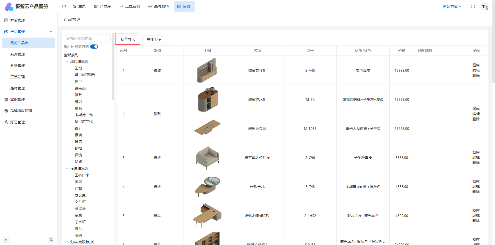

## 下载导入模板
产品信息与详情图、产品图等图片同时导入，选zip模板
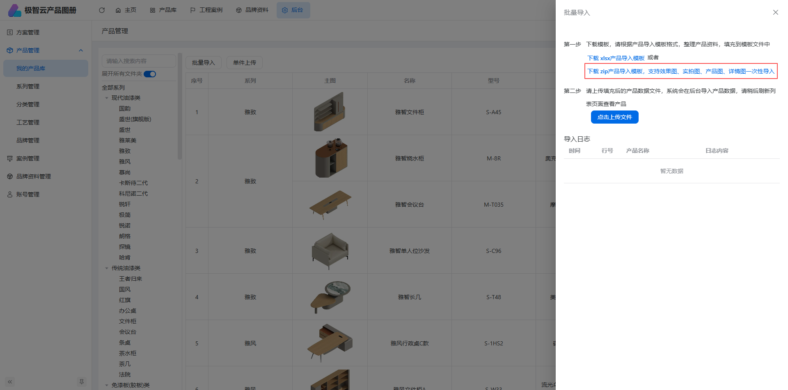

## 解压zip模板文件
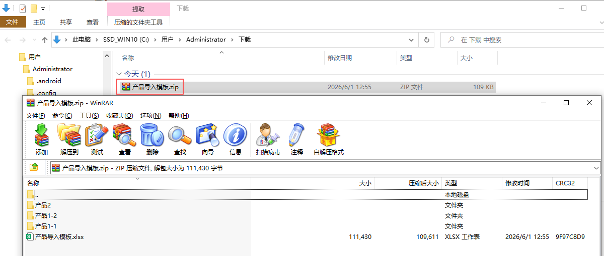
 

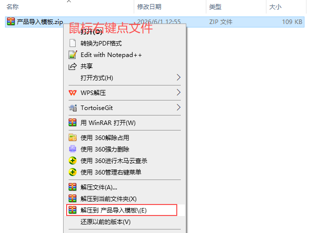

## 模板图片目录
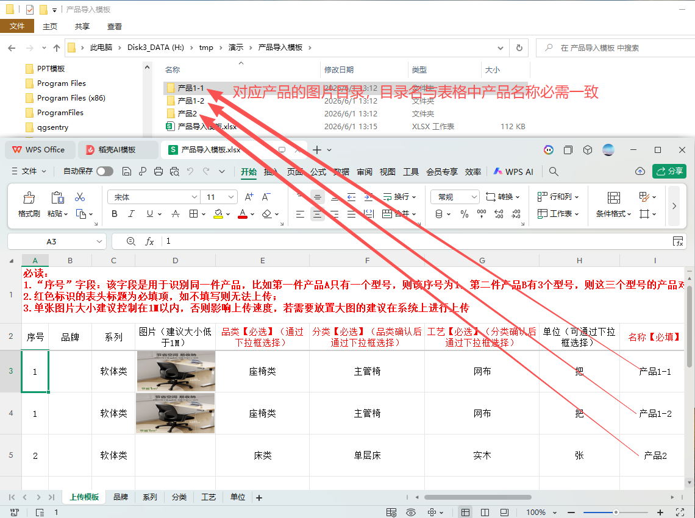
 
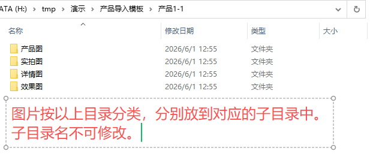

## 修改或新增产品信息到模板excel
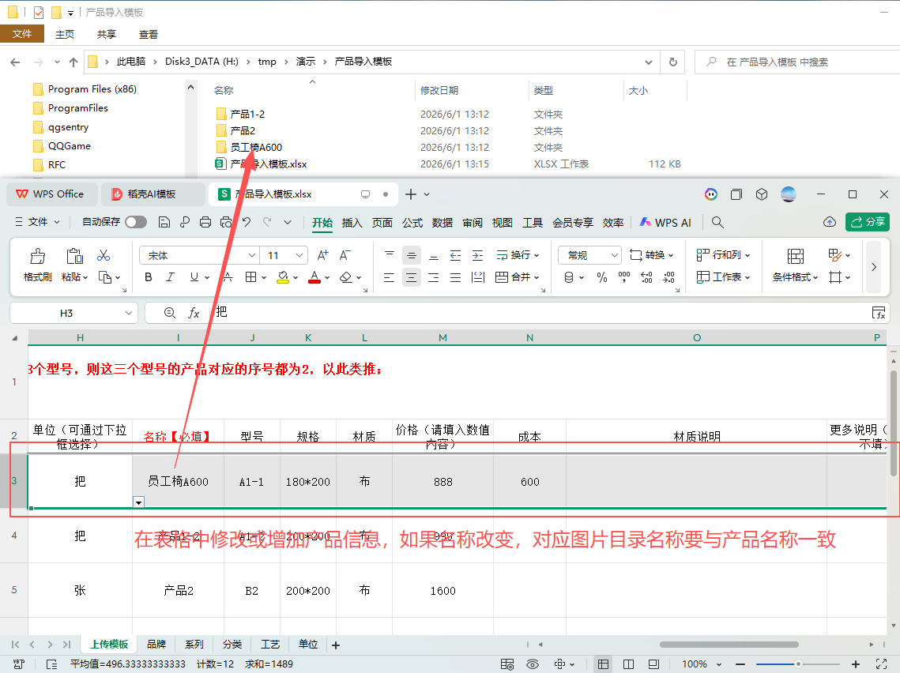
 
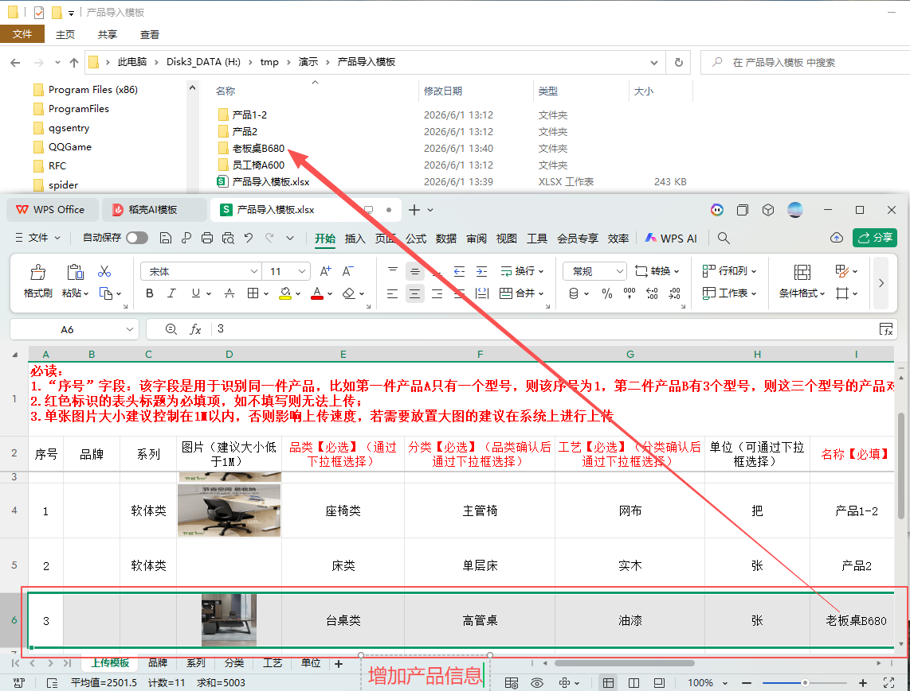

## 添加图片文件到图片目录

注意：图片目录名必需与产品名称一致，否则无法识别到产品的图片。

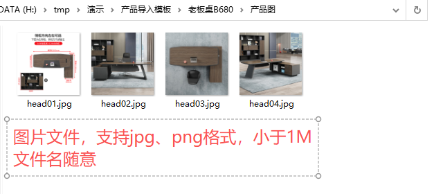
 
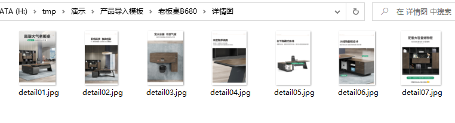

## 压缩excel和图片目录为zip文件
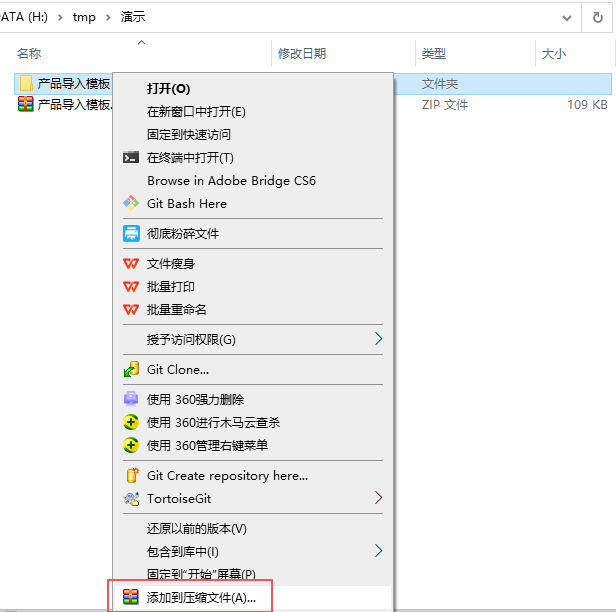
 
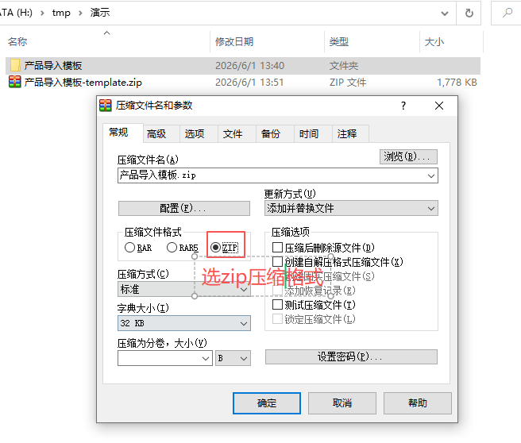

## 上传zip文件
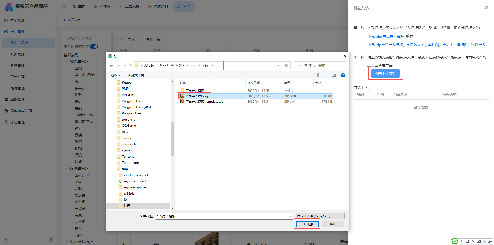

## 产品批量导入日志
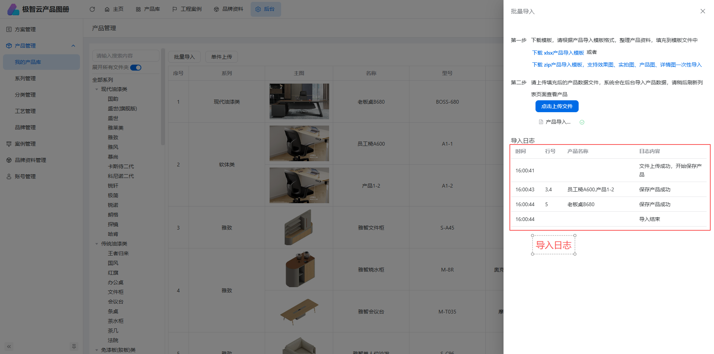

## 管理后台已导入的产品
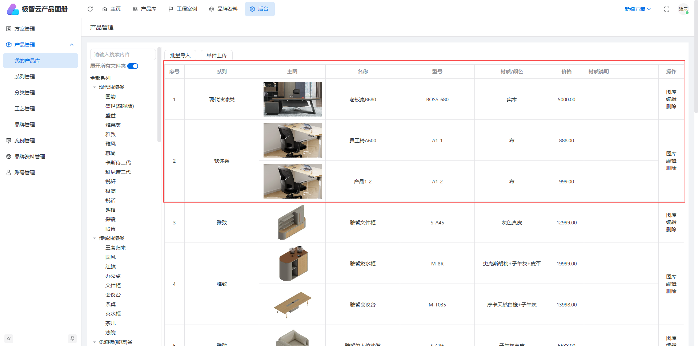
 
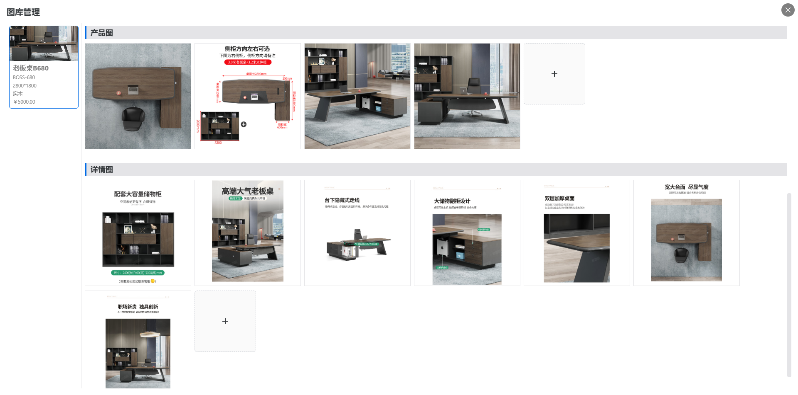

## 产品库已导入的产品
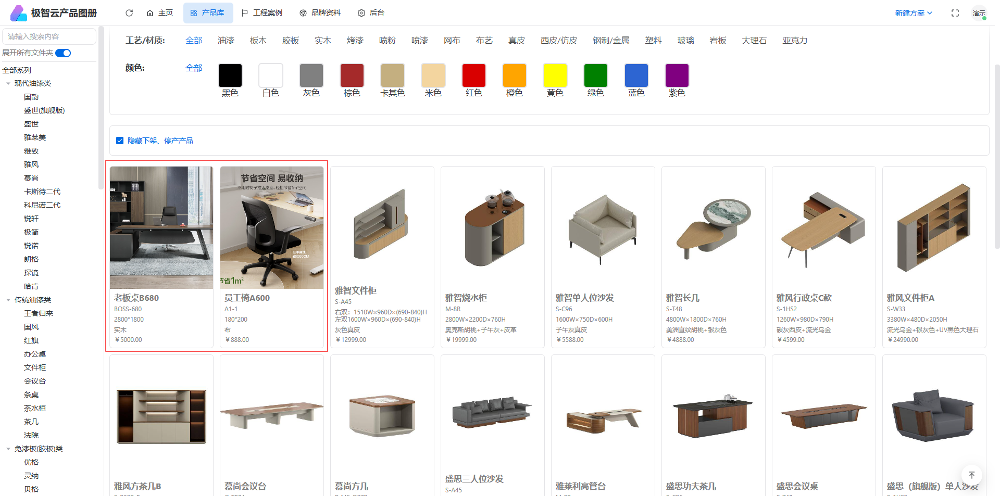

## 已导入产品详情
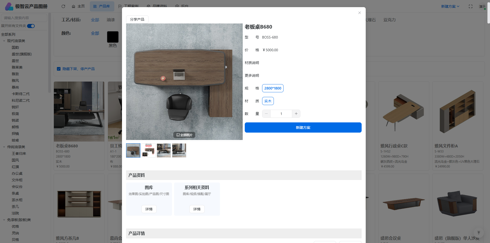
 
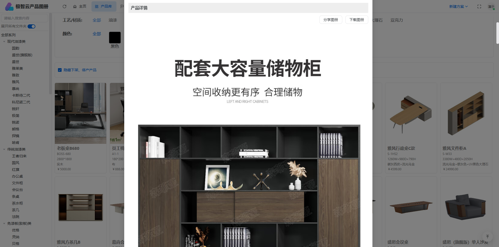

