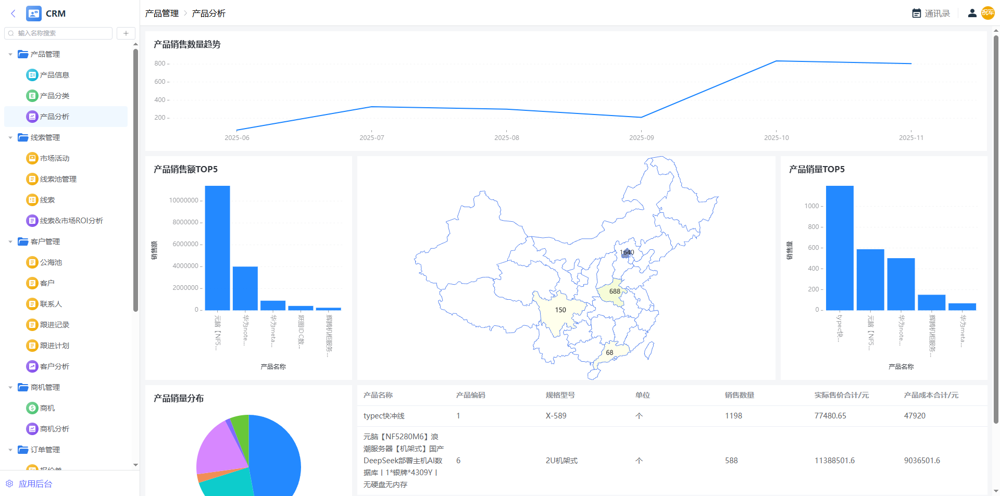
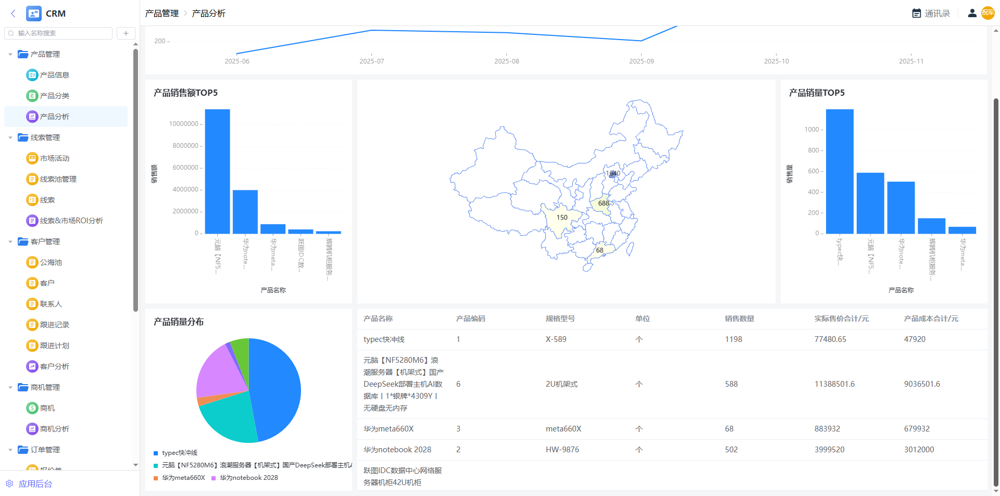
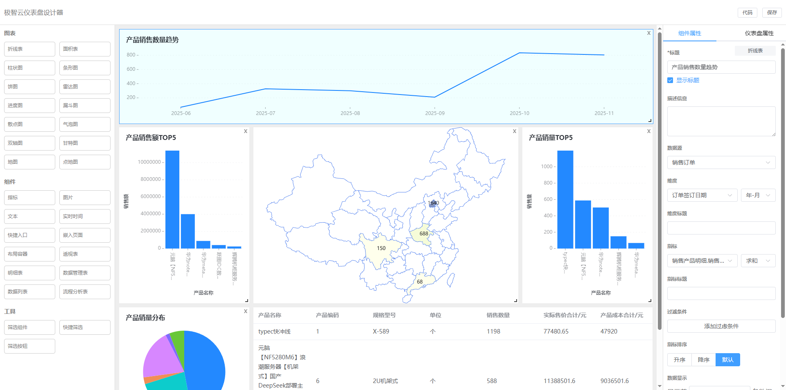
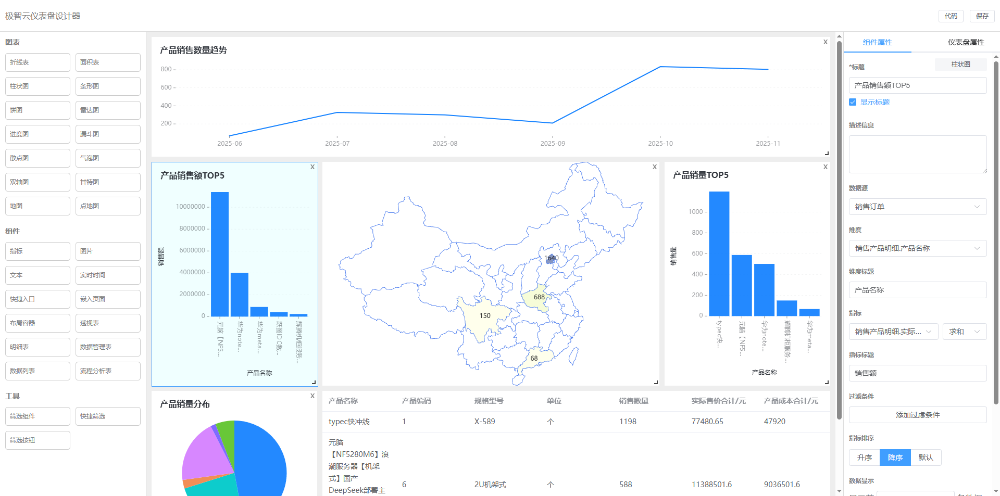
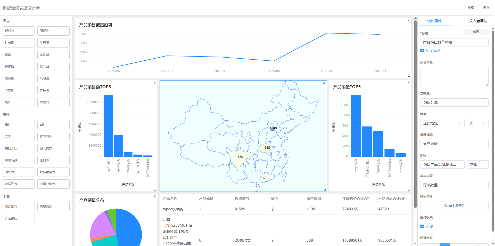
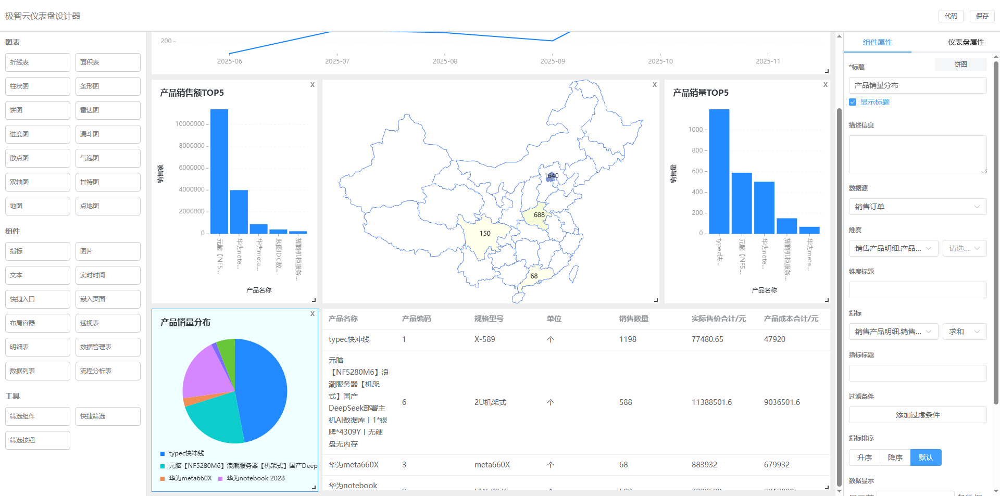
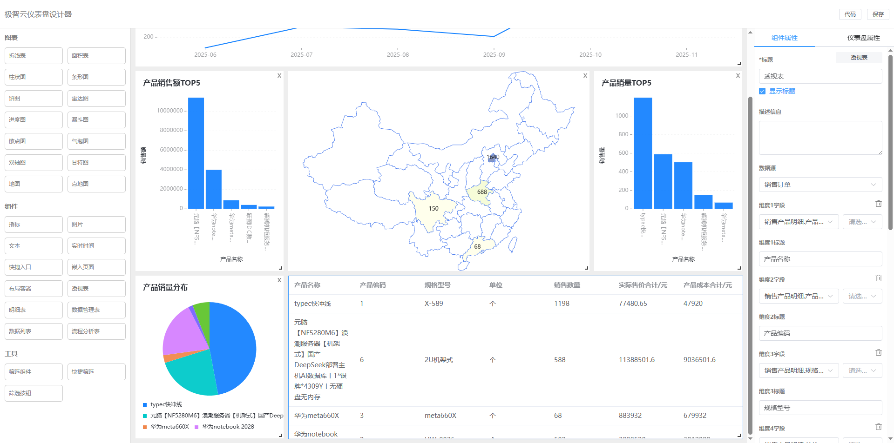

# 极智云仪表盘引擎
极智云仪表盘引擎，支持通过直观的拖拽方式快速搭建业务仪表盘，实现所见即所得的编辑体验。

<b>图表</b>：折线表、面积图、柱状图、条形图、饼图、雷达图、进度图、漏斗图、散点图、气泡图、双轴图、甘特图、地图、点地图。

<b>组件</b>：指标、图片、文本、实时时间、快捷入口、嵌入页面、布局容器、透视表、明细表、数据管理表、数据列表、流程分析表。

<b>工具</b>：筛选组件、快捷筛选、筛选按钮。

## 仪表盘引擎示例:
下面用产品分析实际业务场景展示仪表盘引擎功能和特点。

## 产品分析-仪表盘

 

## 产品分析-设计-销售数量趋势-折线图

## 产品分析-设计-产品销售额TOP5-柱状图

## 产品分析-设计-产品销售数量-地图

## 产品分析-设计-产品销量分布-饼图

## 产品分析-设计-透视表

