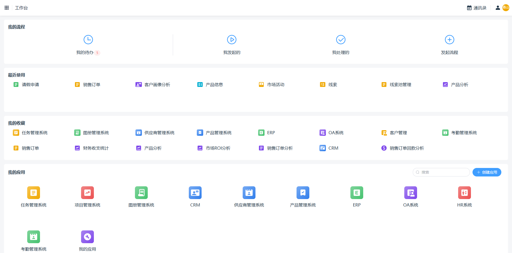
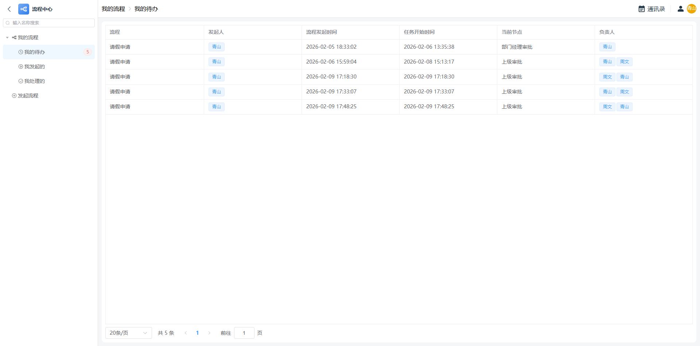
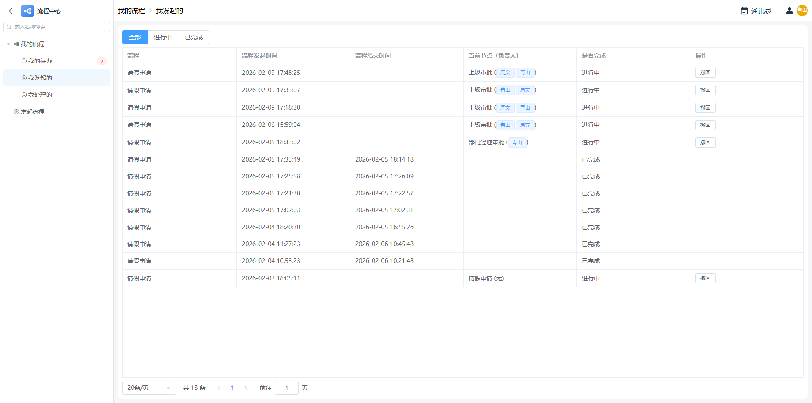
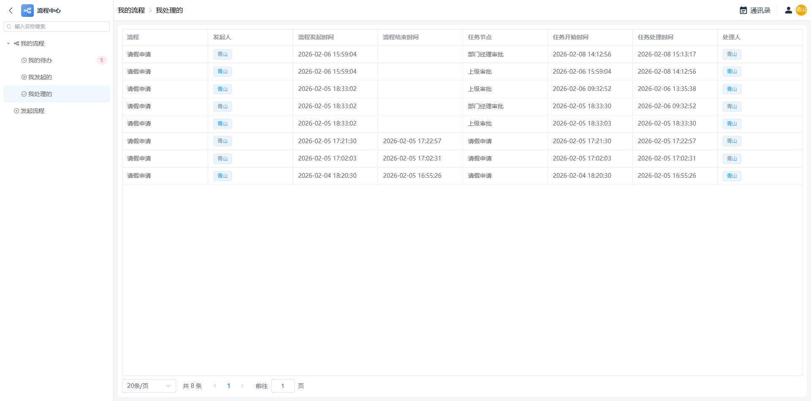
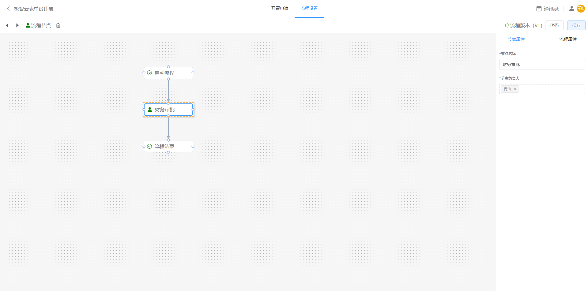

# 极智云流程
极智云流程，通过直观的拖拉拽方式快速搭建业务流程模型，实现所见即所得的配置体验，大幅简化流程设置工作。  
支持将可视化表单直接作为流程数据来源，方便数据关联与调用。  
流程中心可集中管理与处理来自企业各业务系统的全量流程数据，实现统一监控与高效协同。

试用地址：https://joy.eintelli.cn

## 流程示例:
下面为流程使用示例

## 工作台-流程入口 突出展示待办任务数

## 流程中心
我的待办流程任务

我发起的流程

我处理的流程任务

流程中心发起流程页 展示企业所有业务系统中的流程 统一入口

流程中心提交流程表单

流程处理表单

流转图 展示流程执行过程和进度

## 流程表单业务数据
业务数据同步展示流程状态

## 流程可视化设计
开票申请流程设计

请假申请流程设计

