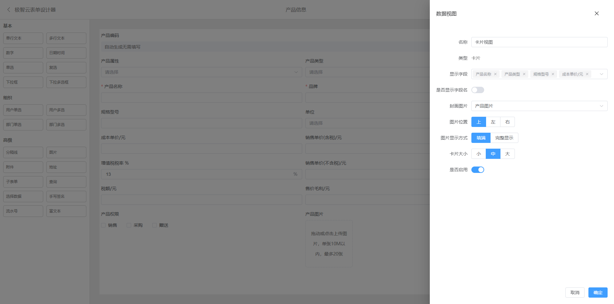
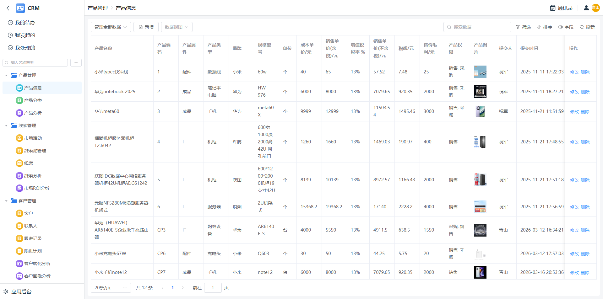
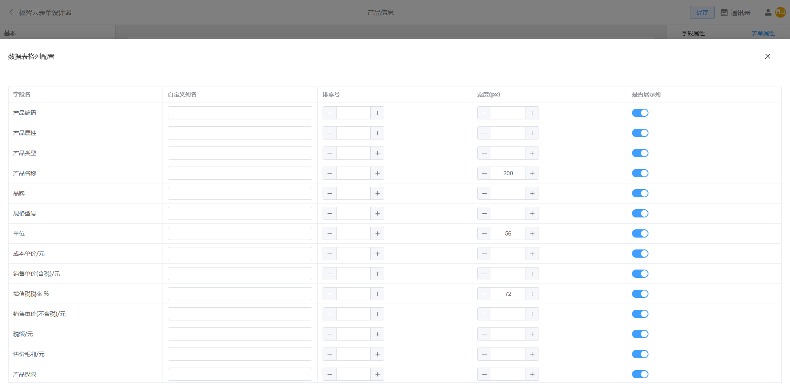
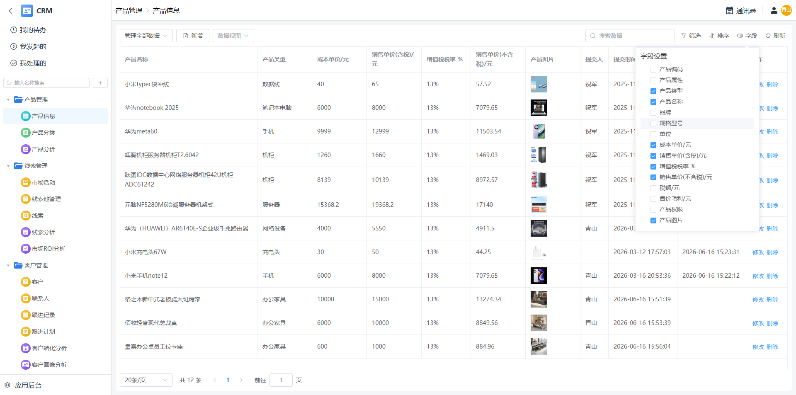

# 表单数据视图
常规数据以表格形式展示，而表单引擎支持用户自定义数据的呈现方式，我们将其称为数据视图。
- **表格视图**：支持对表格列、过滤条件、排序及显示列进行自定义配置。
- **卡片视图**：支持自定义配置卡片显示字段、图片、布局及大小。

免费使用：  
https://joy.eintelli.cn

[返回表单引擎](../index.md)  
[返回表单文档](../doc.md)

## 卡片视图

 

## 卡片视图-小图

 

## 卡片视图-配置

 

## 卡片视图-图片左侧布局

 

## 卡片视图-图片左侧布局-小图

 

## 卡片视图-图片左侧布局-大图

 

## 卡片视图-图片右侧布局

 

## 表格视图

 

## 表格视图-配置

 

## 表格视图-用户自定义显示列

 
