# 极智云表单引擎
极智云表单引擎，拖拉拽方式搭建业务表单，所见即所得。支持基本字段，用户、部门组织架构字段，图片、附件、富文本字段，数据选择、子表单字段20余种。为快速搭建业务应用提供强劲动力。 
支持公式：实现业务计算规则可配置化。 
支持数据联动：关联数据，选择数据，填充数据。实现各业务表单数据关联 

## 表单引擎示例:
下面用商机管理实际业务场景展示表单引擎功能和特点。

## 商机-表单设计
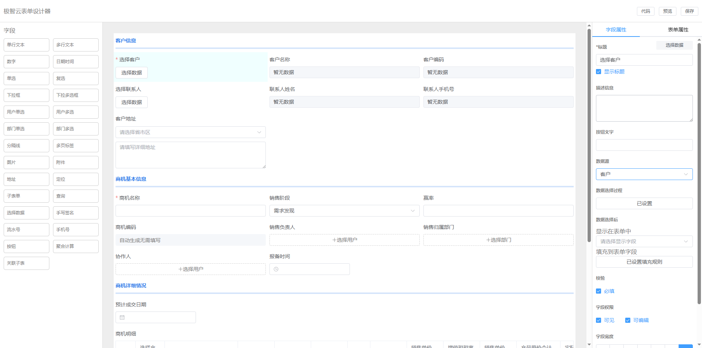
 

## 商机-数据管理
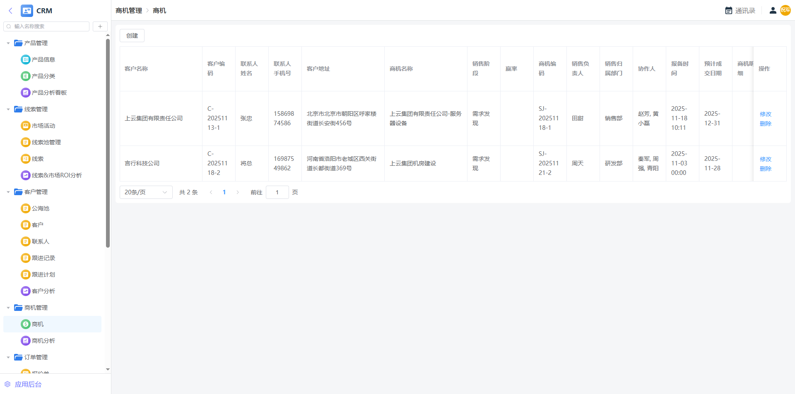

## 商机-数据编辑

 
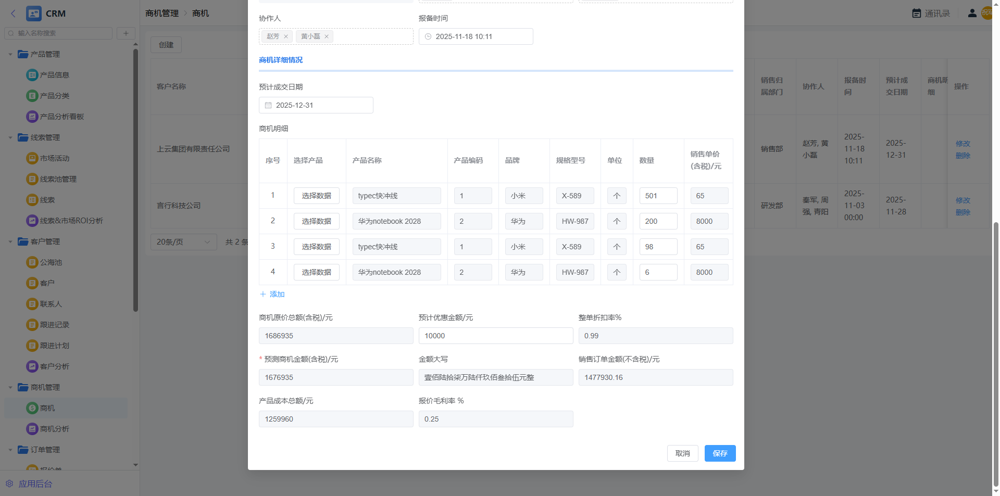

## 商机-选择客户-配置
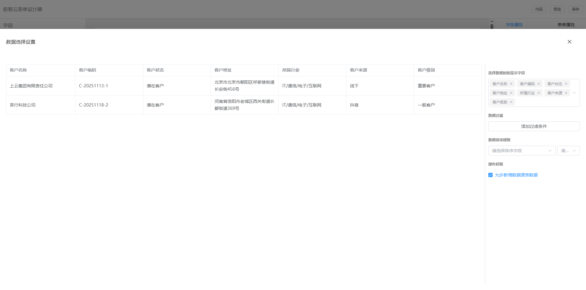

## 商机-选择客户-配置-填充规则
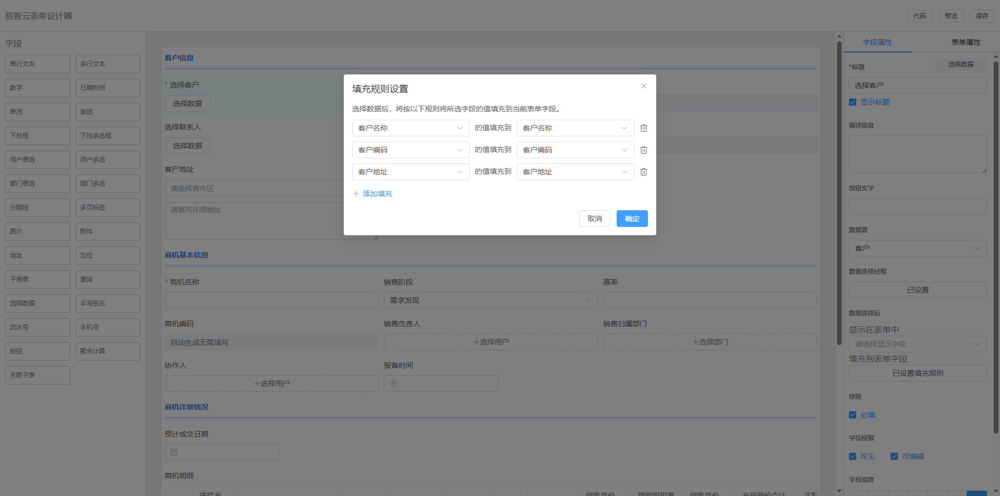

## 商机-选择客户
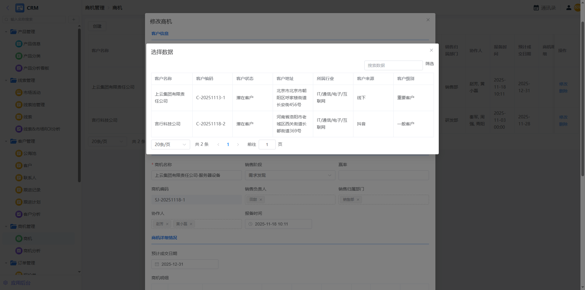

## 商机-产品明细-子表单-配置
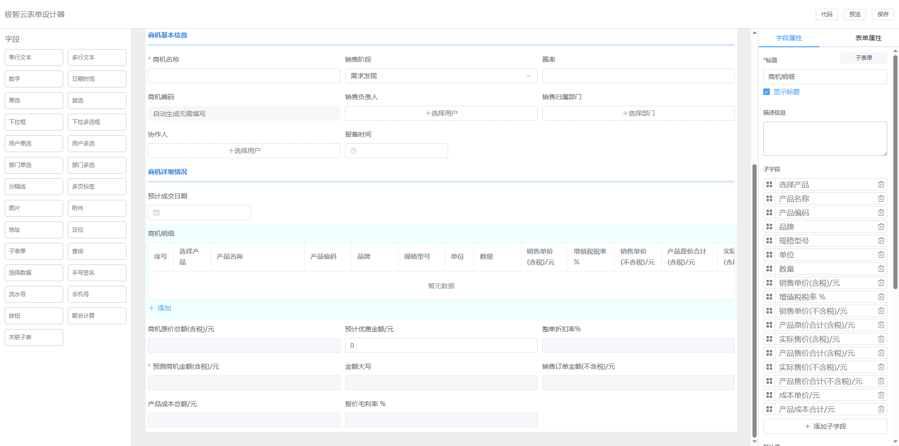

## 商机-从组织中选择负责人
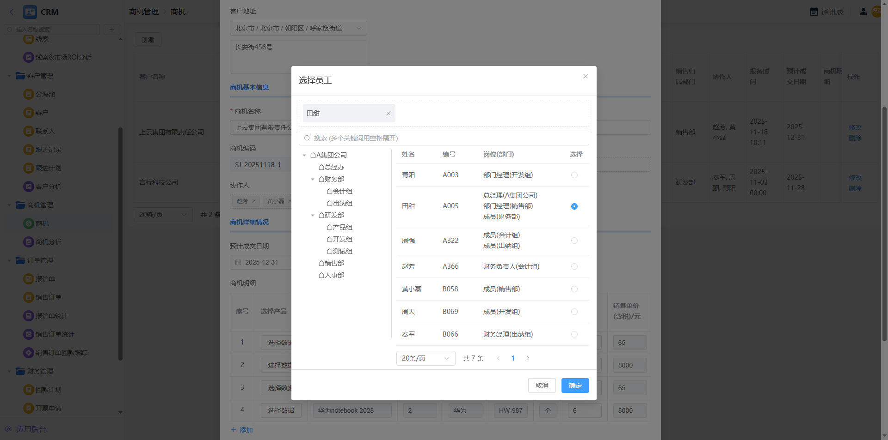

## 商机-业务公式-原单总价
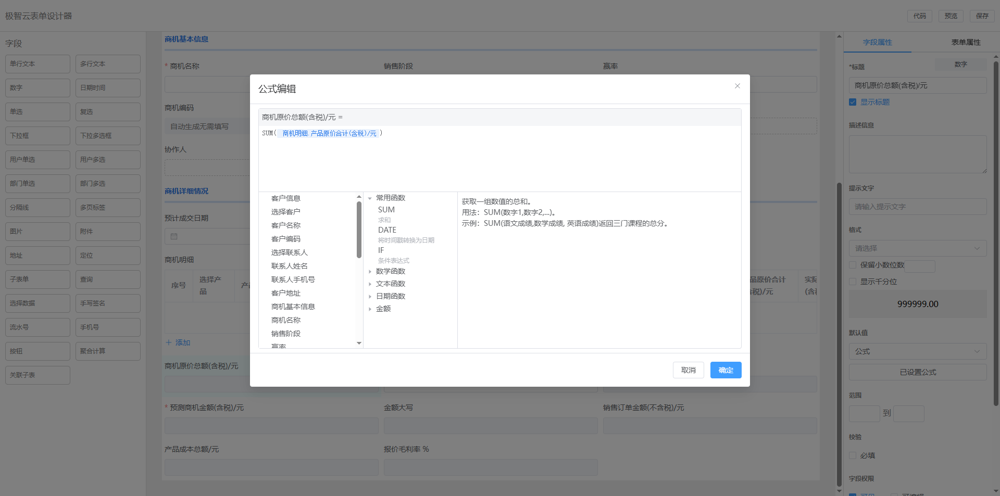

## 商机-业务公式-折扣率
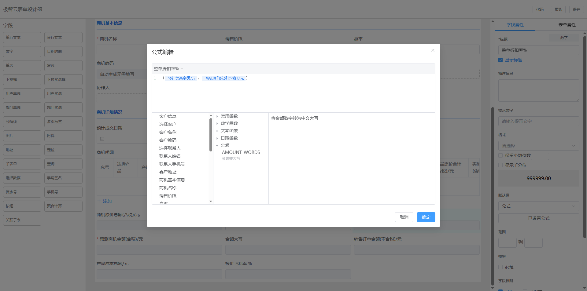

## 开票申请-附件
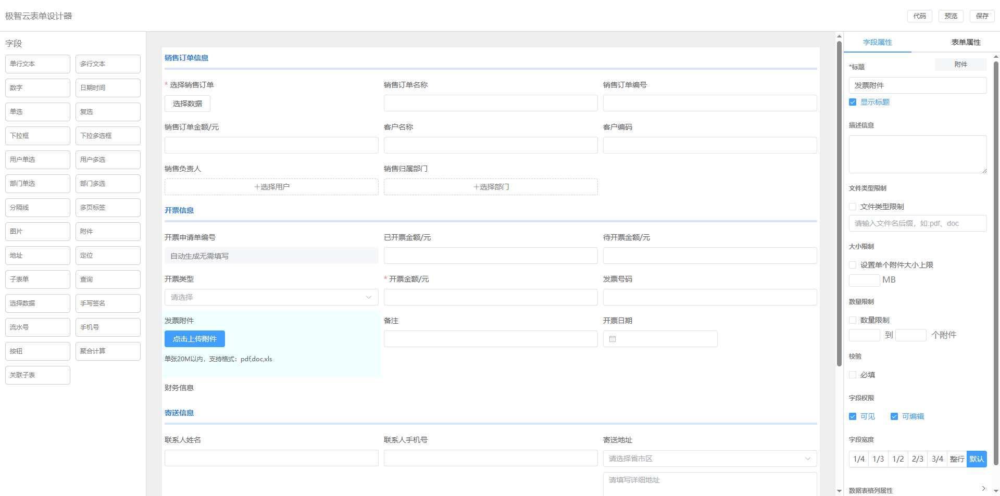

## 产品信息-图片
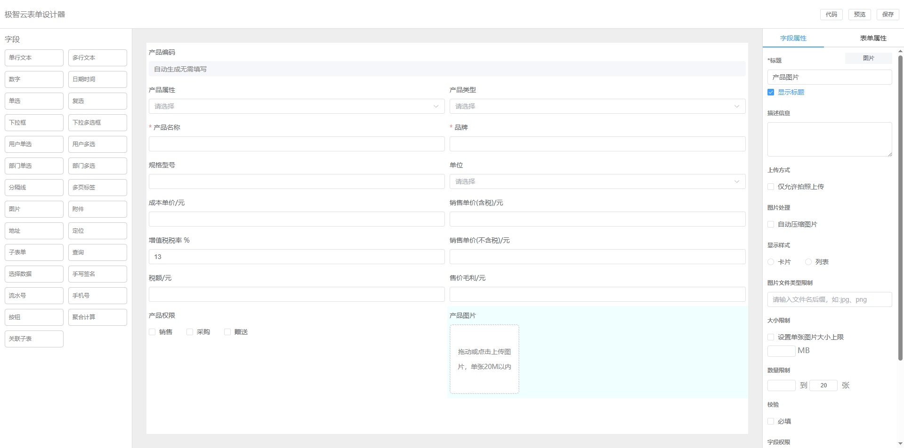
 
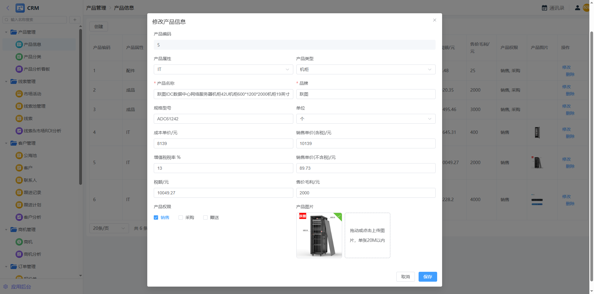
 
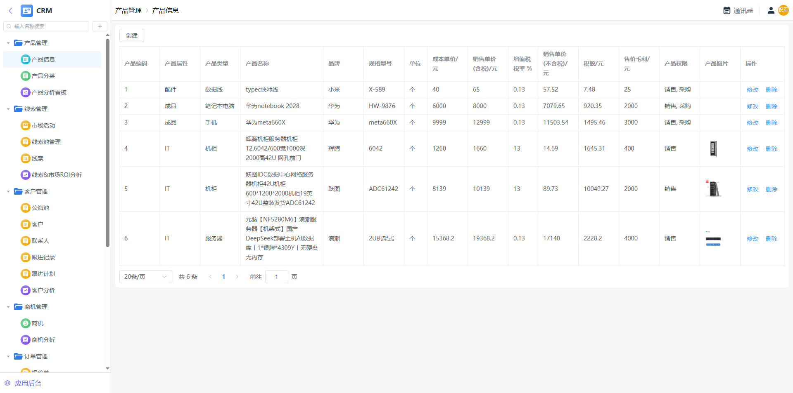

## 工作台
极智云表单引擎与工作台配合，可为企业量身定制搭建满足企业需求的信息化应用系统。

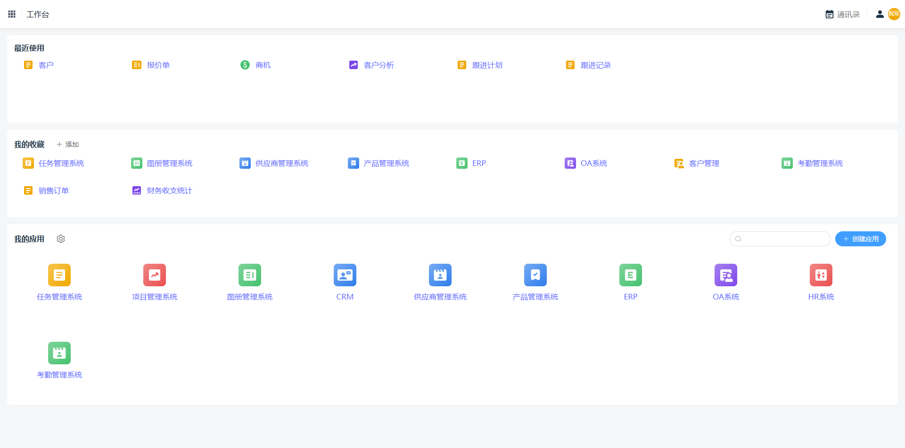

