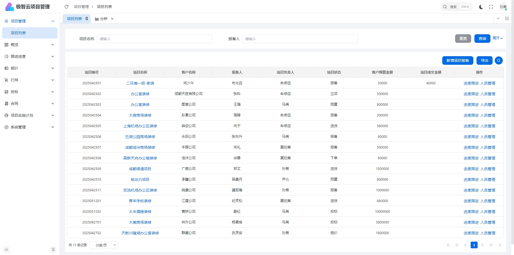
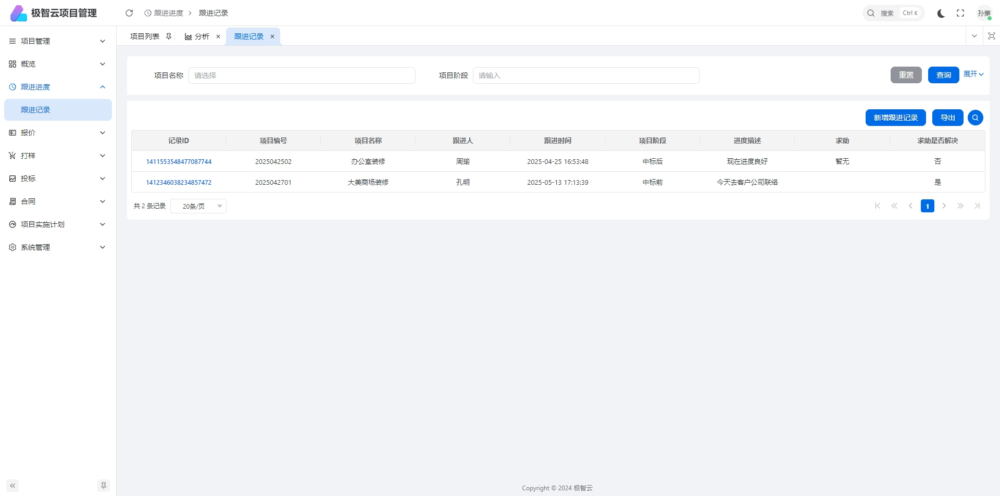
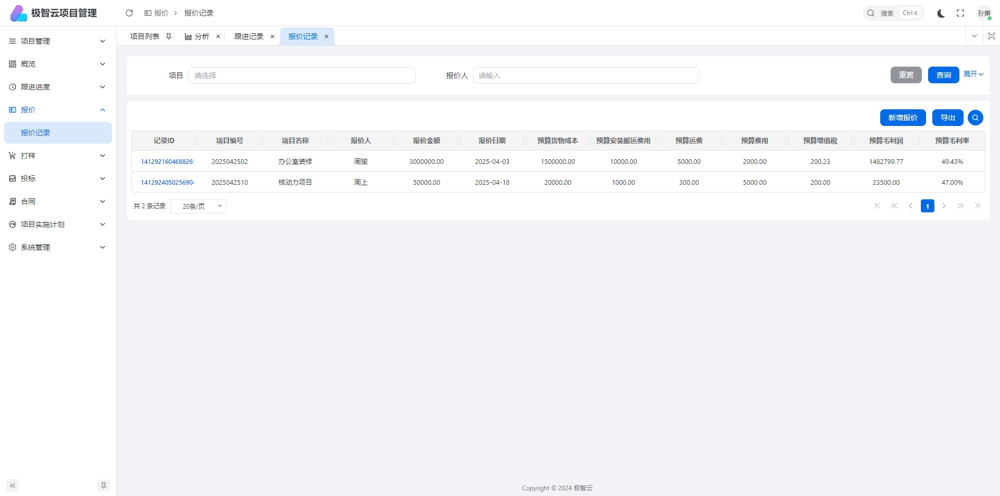
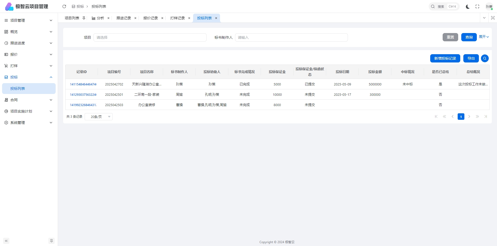
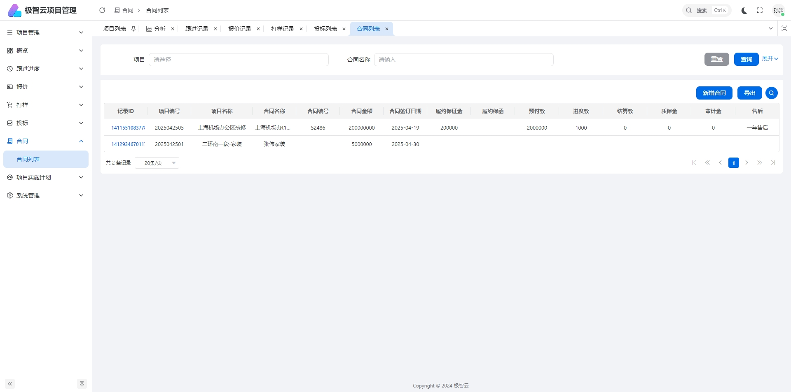
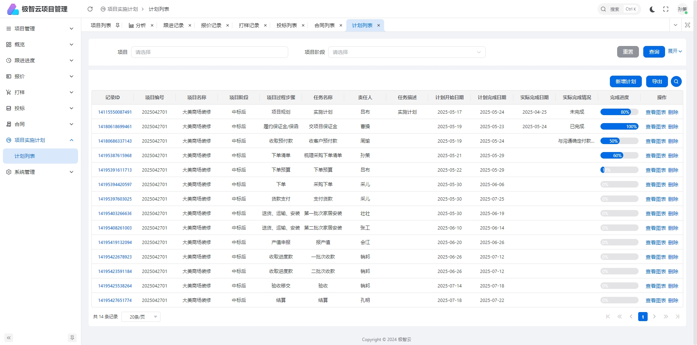
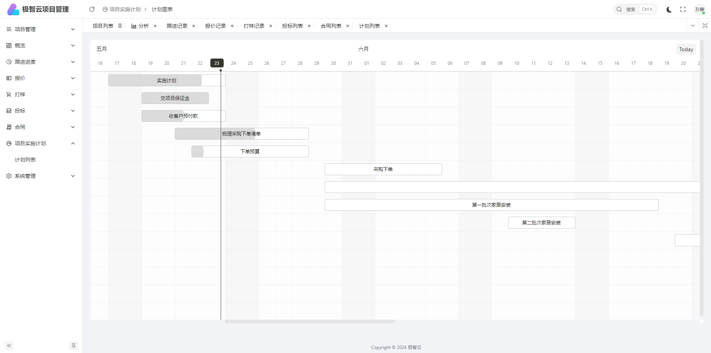

# 极智云项目管理系统
项目全链路生命周期管理，从客户报备，售前跟进，报价，合同。到项目计划，实施，收款，结算。做到项目生命周期全链路数字化智能闭环管理。

智能图表，以图形化方式展示项目数据（柱状图、折线图、热力图等），使无形的数据具象化，让数据会说话。

智能报表，数据驱动决策，效率提升看得见。智能生成每日/周/月数据报告，一键导出。

数智分析，以项目全链路数字化信息为基础，对项目各环节进行数据智能化分析，为企业决策提供科学依据，提升企业效率。

## 项目管理

## 跟进记录

## 报价管理

## 投标管理

## 合同管理

## 实施计划

