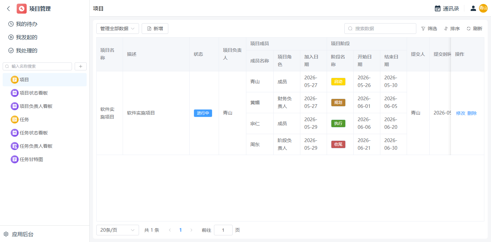
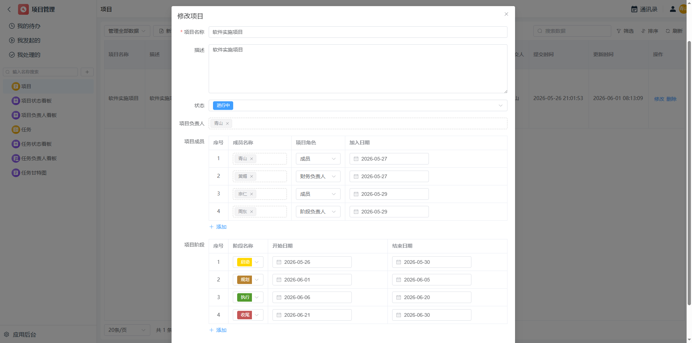
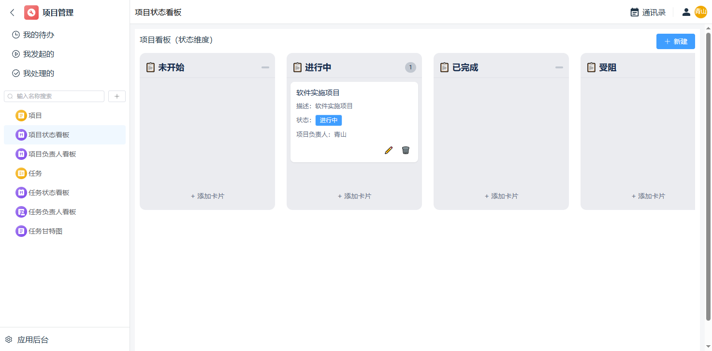
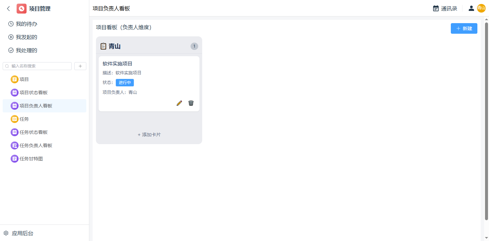
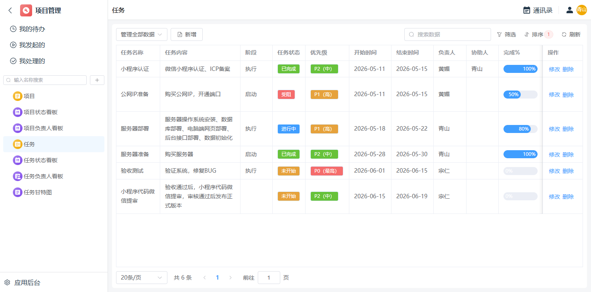
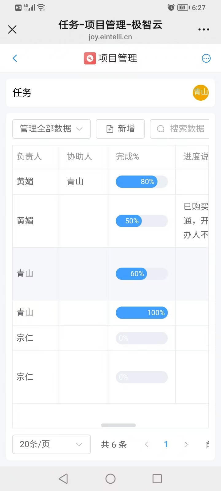
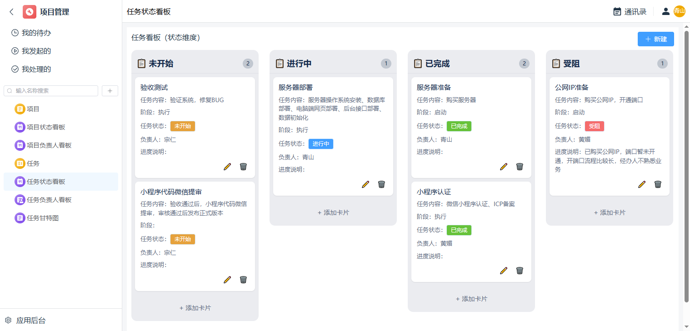
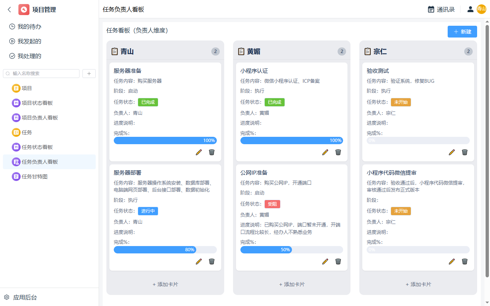
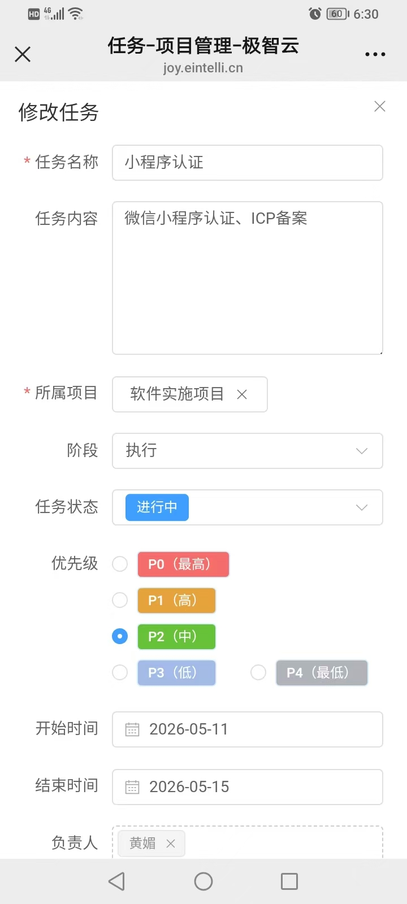
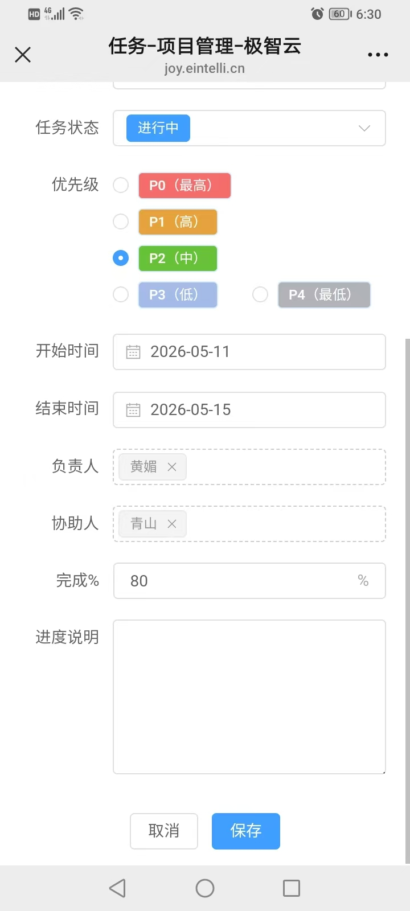

# 极智云项目管理系统
极智云项目管理系统——全链路生命周期管理。覆盖客户报备、售前跟进、报价、合同，贯穿项目计划、实施、收款、结算，实现项目全生命周期的数字化智能闭环管理。

免费使用：  
https://joy.eintelli.cn

## 🚀 核心能力
| 能力模块 | 功能描述 |
|---|---|
| 📊 **可视化图表** | 支持柱状图、折线图、饼图等多种图表类型，直观呈现项目数据趋势与分布，让无形数据化身具象表达，真正让数据开口说话。为企业决策提供科学依据，全面提升运营效率。 |
| 📋 **多维看板** | 提供状态维度看板（按任务状态流转）与负责人维度看板（按人员归属分组），灵活切换管理视角 |
| 🔧 **动态扩展配置** | 表单字段与仪表盘组件支持在线拖拽配置，无需代码即可按需扩展业务模块 |
| 📱 **多端适配** | 电脑端与手机端同步支持，数据实时同步，随时随地管理项目 |

## 项目

### 项目列表

 

### 项目编辑

 

### 项目看板-状态维度

 

### 项目看板-负责人维度

## 任务

### 任务列表

 

### 任务列表-手机端

 

### 任务看板-状态维度

 

### 任务看板-负责人维度

 

### 任务编辑-手机端

 

 