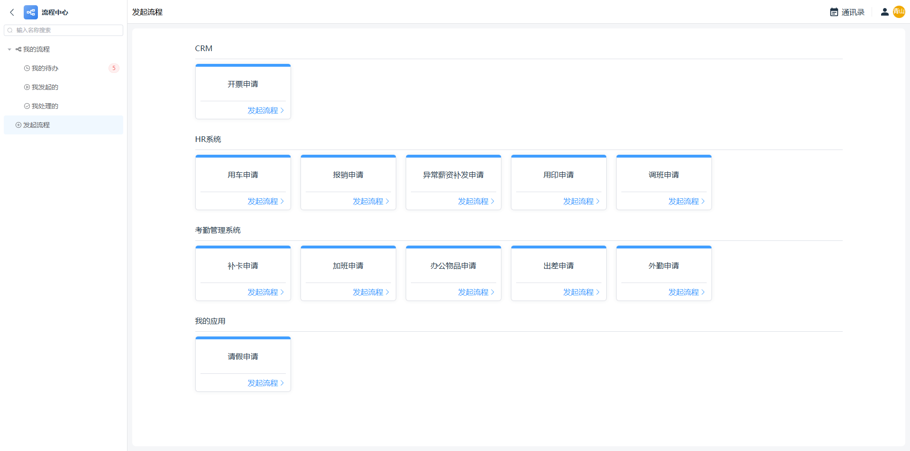
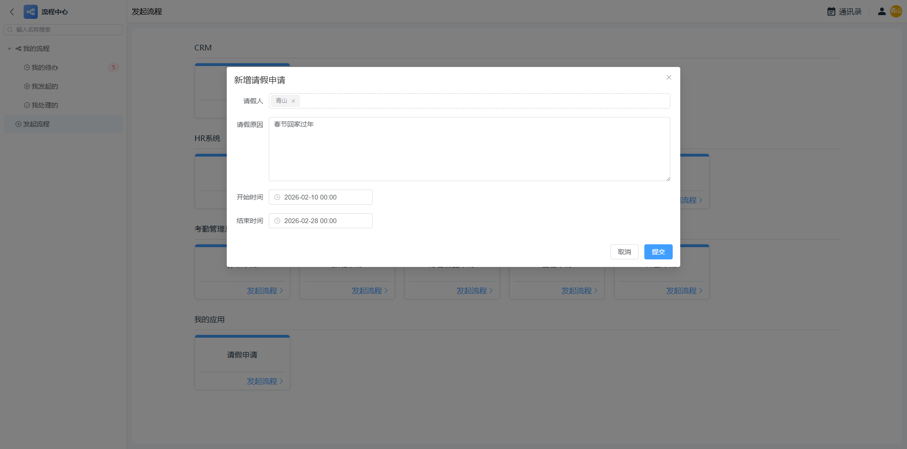
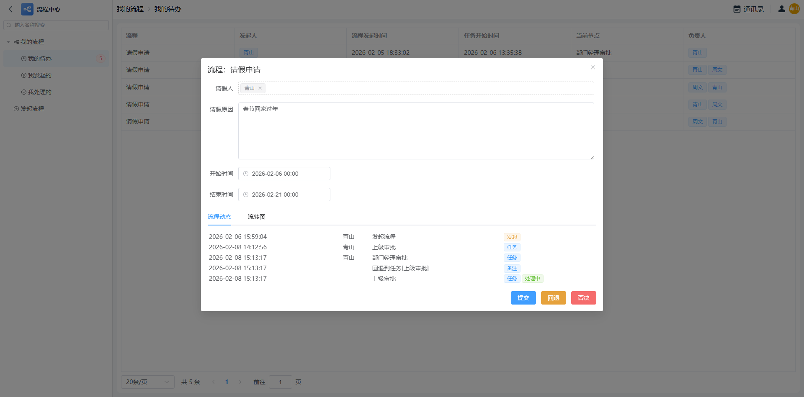
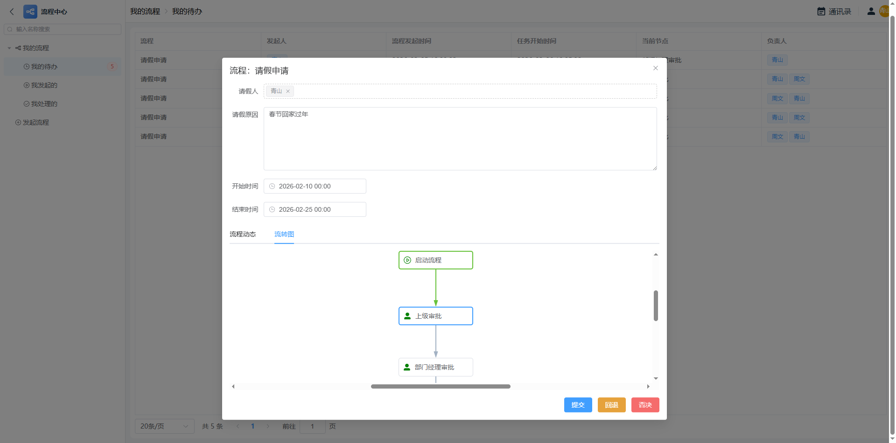

## 工作台
工作台 最近使用 收藏 应用

创建应用

## 应用
应用首页

应用添加表单、仪表盘、目录

用户菜单

快捷切换到其它应用或功能收藏

应用后台

## 通讯录
员工、组织架构、岗位

# 表单
表单数据管理

表单数据筛选

表单数据创建

选择关联数据 按规则自动填充
<video src="./image/07-表单-选择数据2.mp4" type="video/mp4" autoplay loop muted class="pc-img"/>
表单数据修改

子表单

公式

公式

## 查询表

查询表设计器

## 仪表盘设计器

## 流程
流程中心 统一企业流程入口

发起流程

处理流程

流转图

流程设置

